## LAB04 LAN Seguridad y Listas de Acceso

# Tecnologías: ACLs, NAT, PAT, DAI, Port Security, DHCP Snooping 
# Herramientas: Vmware, Eve-NG, Wireshark, Microsoft Visio, Visual Studio Code

 
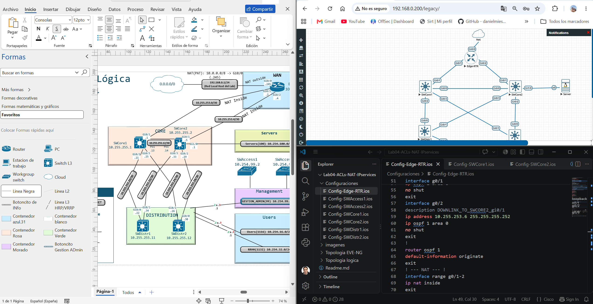

##  Descripción

En este laboratorio mostramos cómo utilizar NAT para que la red interna pueda tener acceso a internet. Además, incluimos protocolos de seguridad que se pueden aplicar directamente en los dispositivos de red, como Port Security para evitar VLAN-Hopping y permitir solo el acceso a equipos con direcciones MAC específicas para un puerto.
Implementamos DHCP Snooping junto con Dynamic ARP Inspection (DAI), el cual evita la suplantación de DHCP (DHCP Spoofing) y el envenenamiento de ARP (ARP Poisoning: respuestas ARP falsas enviadas por un atacante en la red). Además, creamos listas de acceso para segmentar el tráfico y hacer hardening de la red.

La red ya cuenta con la configuración básica y el enrutamiento dinámico (OSPF) realizado en el Lab03.


## Objetivo: 

1. Configurar NAT (PAT) en Edge-RTR para que utilice la IP 192.168.0.245 (simulando una IP pública en nuestro laboratorio de EVE-NG).
2. Configurar el servidor DHCP y servidor Web en Ubuntu Server.
3. Configurar DHCP Snooping, DAI y Port-Security.
4. Configurar ACLs para la VLAN 1116 y la VLAN 1132 haciendo una segmentación de tráfico adecuada.
5. Hacer comprobaciones.


## Notas de campo

• Tuvimos que cambiar las imágenes del laboratorio por IOL, ya que las vIOS tenían muchos problemas con el protocolo HSRP y de enrutamiento que hacían colapsar (crashear) los dispositivos. Ahora el laboratorio es mucho más fluido y sin errores. Hasta ahora recomendaría el uso de las imágenes IOL L2 y L3.

• Lo interesante a partir de ahora es que podemos ampliar y realizar muchas más pruebas sobre este mismo laboratorio. Pueden descargarse el archivo .unl de EVE-NG junto con las configuraciones y replicar el laboratorio usando imágenes IOL para Switches L2 y L3: i86bi_LinuxL2-AdvEnterpriseK9-M_152_May_2018, y para Routers: i86bi_LinuxL3-AdvEnterpriseK9-M2_157_3_May_2018.

• En los archivos de configuracion de dispositivos no se incluyen las configuraciones de seguridad ni ACLs, ya que reutilizaremos el lab para nuevas configuraciones.


---

##  Topología de la Red
Microsoft Visio


###  Device's Management IPs

|Dispositivo|Management IP|
|:----|:----|
|SWCore1|10.255.255.1|
|SWCore1|10.255.255.2|´
|SWDistr1|10.255.255.11|
|SWDistr2|10.255.255.12|
|SWAccess1|10.254.99.2|
|SWAccess2|10.254.99.3|
|Edge-RTR|10.255.254.11|
|Server|10.254.100.100|


###  Tabla de Direccionamiento 


|Dispositivo|Interfaz|Tipo de Puerto|VLAN|Dirección IP / Máscara|Gateway / Next-Hop|Vecino/ Puerto Destino|
|:----|:----|:----|:----|:----|:----|:----|
|SWCore1|Loopback 0|Logico|N/A|10.255.255.1/32|N/A|N/A|
| |Po1|Enrutado|N/A|10.255.255.13/30|10.255.255.14/30|SWCore2 (Po1)|
| |e0/0|Po1|N/A|N/A|N/A|SWCore2 (e0/0)|
| |e0/1|Po1|N/A|N/A|N/A|SWCore2 (e0/1)|
| |e0/2|Enrutado|N/A|10.255.255.21/30|10.255.255.22/30|SWDistr1 (e0/0)|
| |e0/3|Enrutado|N/A|10.255.255.25/30|10.255.255.26/30|SWDistr2 (e0/1)|
|SWCore2|Loopback 0|Logico|N/A|10.255.255.2/32|N/A|N/A|
| |Po1|Enrutado|N/A|10.255.255.14/30|10.255.255.13/30|SWCore1 (Po1)|
| |e0/0|Po1|N/A|N/A|N/A|SWCore1 (e0/0)|
| |e0/1|Po1|N/A|N/A|N/A|SWCore1 (e0/1)|
| |e0/2|Enrutado|N/A|10.255.255.29/30|10.255.255.30/30|SWDistr2 (e0/0)|
| |e0/3|Enrutado|N/A|10.255.255.33/30|10.255.255.34/30|SWDistr1 (e0/1)|
| |Vlan 100|SVI|100|10.254.100.1/24|10.254.100.100|Server (e/0)|
|SWDistr1|Loopback 0|Logico|N/A|10.255.255.11/32|N/A|N/A|
| |e0/0|Enrutado|N/A|10.255.255.22/30|10.255.255.21/30|SWCore1 (e0/2)|
| |e0/1|Enrutado|N/A|10.255.255.34/30|10.255.255.33/30|SWCore2 (e0/3)|
| |e0/2|Trunk|99,1116,1132|N/A|N/A|SWAccess1 (e0/1)|
| |e0/3|Trunk|99,1116,1132|N/A|N/A|SWAccess2 (e0/2)|
| |Vlan 99|SVI|99|10.254.99.2/24|HSRP 10.254.99.1/24|Gestión|
| |Vlan 1116|SVI|1116|10.254.16.2/24|HSRP 10.254.16.1/24|N/A|
| |Vlan 1132|SVI|1132|10.254.32.2/24|HSRP 10.254.32.1/24|N/A|
|SWDistr2|Loopback 0|Logico|N/A|10.255.255.12/32|N/A|N/A|
| |e0/0|Enrutado|N/A|10.255.255.30/30|10.255.255.29/30|SWCore2 (e0/2)|
| |e0/1|Enrutado|N/A|10.255.255.26/30|10.255.255.25/30|SWCore1 (e0/3)|
| |e0/2|Trunk|99,1116,1132|N/A|N/A|SWAccess2 (e0/1)|
| |e0/3|Trunk|99,1116,1132|N/A|N/A|SWAccess1 (e0/2)|
| |Vlan 99|SVI|99|10.254.99.3/24|HSRP 10.254.99.1/24 |Gestión|
| |Vlan 1116|SVI|1116|10.254.16.3/24|HSRP 10.254.16.1/24|N/A|
| |Vlan 1132|SVI|1132|10.254.32.3/24|HSRP 10.254.32.1/24 |N/A|
|SWAccess1|e0/0|Access|1116|N/A|N/A|PC1 Linux|
| |e0/1|Trunk|99,1116,1132|N/A|N/A|SWDistr1 (e0/2)|
| |e0/2|Trunk|99,1116,1132|N/A|N/A|SWDistr2 (e0/3)|
|SWAccess2|G0/0|Access|1132|N/A|N/A|PC2 VPC|
| |e0/1|Trunk|99,1116,1132|N/A|N/A|SWDistr2 (e0/2)|
| |e0/2|Trunk|99,1116,1132|N/A|N/A|SWDistr1(e0/3)|
| Edge-RTR    | e0/0     | Enrutado       | N/A  | 192.168.0.254          | 0.0.0.0            | Internet               |   |   |   |
|             | e0/1     | Enrutado       | N/A  | 10.254.253.2           | 10.254.253.1       | SWCore1 (e0/1)         |   |   |   |
|             | e0/2     | Enrutado       | N/A  | 10.254.253.6           | 10.254.253.5       | SWCore2(e0/1)          |   |   |   |

###  Configuración de dispositivos

Las configuraciones completas de cada dispositivo están disponibles en la carpeta [`configuraciones/`](./configuraciones):

|Dispositivo|Archivo|Descripción|
|:----|:----|:----|
|SWAccess1|[Config-SWAccess1.ios](./Configuraciones/Config-SWAccess1.ios)|Config Completa|
|SWAccess2|[Config-SWAccess2.ios](./Configuraciones/Config-SWAccess2.ios)|Config Completa|
|SWDistr1|[Config-SWDistr1.ios](./Configuraciones/Config-SWDistr1.ios)|Config Completa|
|SWDistr2|[Config-SWDistr2.ios](./Configuraciones/Config-SWDistr2.ios)|Config Completa|
|SWCore1|[Config-SWCore1.ios](./Configuraciones/Config-SWCore1.ios)|Config Completa|
|SWCore2|[Config-SWCore2.ios](./Configuraciones/Config-SWCore2.ios)|Config Completa|
|SWCore2|[Config-Edge-RTR.ios](./Configuraciones/Config-Edge-RTR.ios)|Config Completa|

###  Pruebas y Verificación

### Verificación de Configuraciones (show commands y capturas)

### DHCP SERVER EN LINUX UBUNTU SERVER

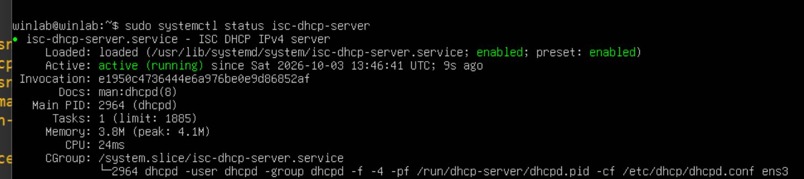
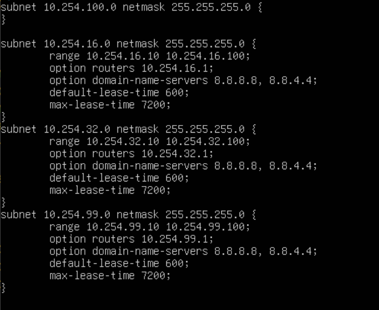


### DHCP SNOOPING & DAI

DHCP
```
SWAccess1(config)#ip dhcp snooping
SWAccess1(config)#ip dhcp snooping vlan 1116,1132,99
SWAccess1(config)#no ip dhcp snooping information option
SWAccess1(config)#interface range e0/1-2
SWAccess1(config-if)#ip dhcp snooping trust
```

```
SWAccess2(config)#ip dhcp snooping
SWAccess2(config)#ip dhcp snooping vlan 1116,1132,99
SWAccess2(config)#no ip dhcp snooping information option
SWAccess2(config)#interface range e0/1-2
SWAccess2(config-if)#ip dhcp snooping trust
```
DAI
```
SWAccess1(config)#ip arp inspection vlan 1116,1132,99
SWAccess1(config)#ip arp inspection validate src-mac
SWAccess1(config)#interface range e0/1-2
SWAccess1(config-if)#ip arp inspection trust
```
```
SWAccess2(config)#ip arp inspection vlan 1116,1132,99
SWAccess2(config)#ip arp inspection validate src-mac
SWAccess2(config)#interface range e0/1-2
SWAccess2(config-if)#ip arp inspection trust
```

**El comando: ip arp inspection validate src-mac compara la src-mac del cuerpo del mensaje ARP con la src-mac del campo ethernet para verificar la integridad del ARP**

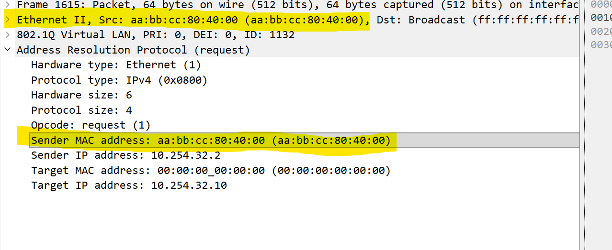

**DHCP BINDINGS**

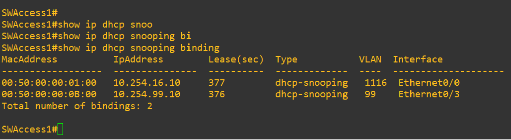

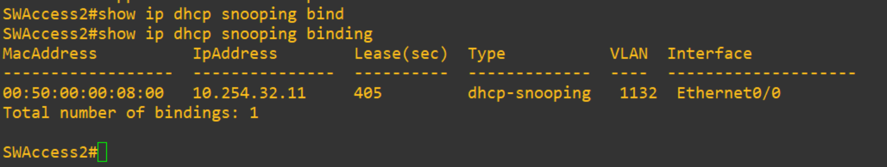

### Port-Security

```
SWAccess1(config)#interface range e0/0,e0/3
SWAccess1(config-if)#switchport port-security
SWAccess1(config-if)#switchport port-security mac-address sticky
SWAccess1(config-if)#switchport port-security violation shutdown
```

```
SWAccess2(config)#interface e0/0
SWAccess2(config-if)#switchport port-security
SWAccess2(config-if)#switchport port-security mac-address sticky
SWAccess2(config-if)#switchport port-security violation shutdown
```
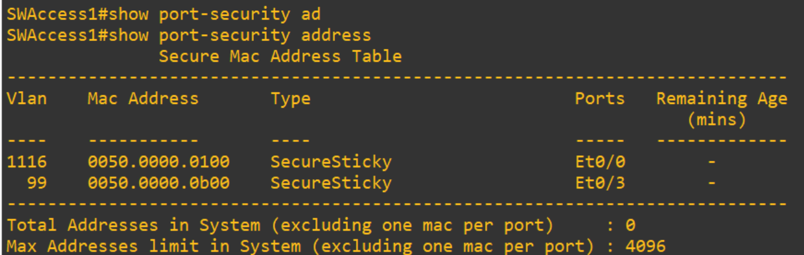

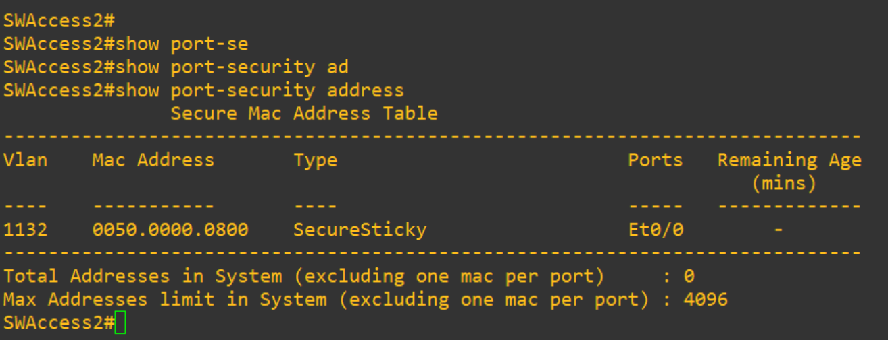

### Port-Security: Cambiamos MAC en PC1 para demostrar el funcionamiento de Port-Security
1. Cambiamos la MAC en PC1
2. Port-Security en SWAccess1 compara la nueva MAC de PC1 con la mac aprendida sticky, y detecta el Security Violation
3. El puerto se apaga y queda en errDisable y aumenta el contador de Security Violation Count
4. Luego podemos reestablecer el puerto con shut y no shut.
5. Támbien pudieramos usar estos comandos para hacer automatico el reestablecimiento:
```
Switch(config)# errdisable recovery cause psecure-violation
Switch(config)# errdisable recovery interval 180
```

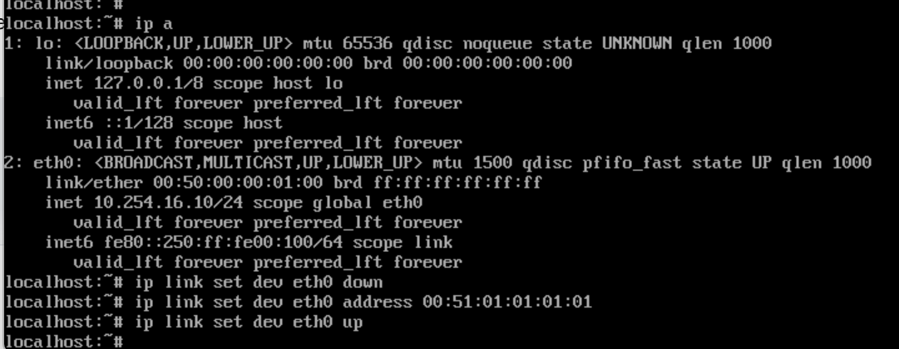


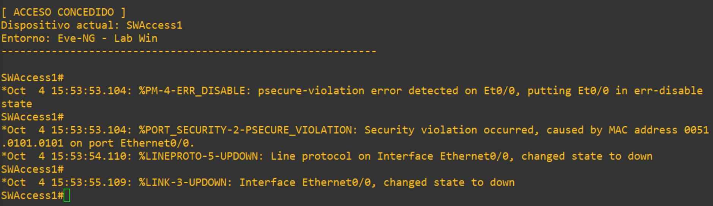
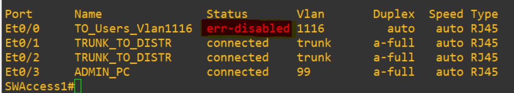
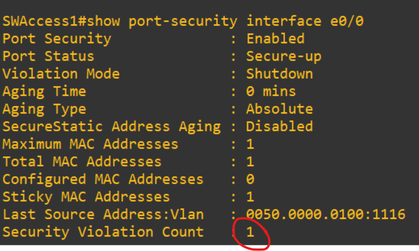

### ACLS

### ACL para Management vlan 99: Solo los equipos en esa subred pueden administrar SWAccess1 y SWAccess2

- Permitimos DHCP y HSRP para que siga funcionando normal.

```
ip access-list extended V99-IN
 permit udp any host 224.0.0.2 eq 1985
 permit udp any host 224.0.0.102 eq 1985
 permit udp any eq 68 any eq 67
 permit ip 10.254.99.0 0.0.0.255 any
!
exit
!
interface Vlan99
 ip access-group V99-IN in
 exit
 !
 ip access-list standard MGMT-ONLY
 remark Solo la VLAN 99 (Admin) puede gestionar
 permit 10.254.99.0 0.0.0.255
 deny any log
 exit
!
line vty 0 4
 access-class MGMT-ONLY in
 exit
 !
```

 ### ACL para Management de todos los equipos: SWAccess1,2 , SWCore1 y 2, SWdDistri 1 y 2, Edge-RTR y hacemos que aparezcan logs si alguien intenta acceder a las vty desde otra ip que no es esa.

```

ip access-list standard MGMT-ONLY
 remark Solo la VLAN 99 (Admin) puede gestionar
 permit 10.254.99.0 0.0.0.255
 deny any log
 exit
!
line vty 0 4
 access-class MGMT-ONLY in
 exit
 !
```
 ### ACLs VLAN 1116
 - Permitimos HSRP y DHCP
 - Permitimos tráfico HTTP, DNS y Ping hacia el server
 - Bloqueamos tráfico hacia cualquier otro destino que no sea el Server e Internet y que genere log (Vlan 1116 no se comunica con vlan 1132 ni 99)
 - Si puede responeder a la vlan 99 de management

```
ip access-list extended V1116-IN
 remark --- HSRP v1/v2 ---
 permit udp any host 224.0.0.2 eq 1985
 permit udp any host 224.0.0.102 eq 1985
 remark --- DHCP: broadcast inicial y renovacion unicast ---
 permit udp any eq 68 any eq 67
 permit udp 10.254.16.0 0.0.0.255 eq 68 host 10.254.100.100 eq 67
 remark --- PC1: solo HTTP, DNS y ping al Server ---
 permit tcp 10.254.16.0 0.0.0.255 host 10.254.100.100 eq 80
 permit udp 10.254.16.0 0.0.0.255 host 10.254.100.100 eq 53
 permit icmp 10.254.16.0 0.0.0.255 host 10.254.100.100 echo
 remark --- Ping al gateway (VIP, .2 y .3) ---
 permit icmp 10.254.16.0 0.0.0.255 10.254.16.0 0.0.0.255 echo
 remark --- Retornos hacia conexiones iniciadas por Admin ---
 permit icmp 10.254.16.0 0.0.0.255 10.254.99.0 0.0.0.255 echo-reply
 permit tcp 10.254.16.0 0.0.0.255 10.254.99.0 0.0.0.255 established
 remark --- Bloqueos con log ---
 deny ip 10.254.16.0 0.0.0.255 10.254.99.0 0.0.0.255 log
 deny ip 10.254.16.0 0.0.0.255 10.254.32.0 0.0.0.255 log
 deny ip 10.254.16.0 0.0.0.255 10.254.100.0 0.0.0.255 log
 deny ip 10.254.16.0 0.0.0.255 10.255.0.0 0.0.255.255 log
 remark --- Resto: Internet (PAT en Edge) ---
 permit ip 10.254.16.0 0.0.0.255 any
 remark --- Origen falso ---
 deny ip any any log-input
!
interface Vlan1116
 ip access-group V1116-IN in
end
```

### ACLs VLAN 1132

 - Permitimos HSRP y DHCP
 - Permitimos trafico HTTP hacia el server solo de 8:00 a 18:00 de lunes a viernes
 - Bloqueamos trafico hacia cualquier otro destino que no sea el Server e Internet y que genere log (Vlan 1132 no se comunica con vlan 1116 ni 99)
 - Si puede responeder a la vlan 99 de management

```
conf t
time-range HORARIO-LAB
 periodic weekdays 8:00 to 18:00
!
no ip access-list extended V1132-IN
ip access-list extended V1132-IN
 remark --- HSRP v1/v2 ---
 permit udp any host 224.0.0.2 eq 1985
 permit udp any host 224.0.0.102 eq 1985
 remark --- DHCP: broadcast inicial y renovacion unicast ---
 permit udp any eq 68 any eq 67
 permit udp 10.254.32.0 0.0.0.255 eq 68 host 10.254.100.100 eq 67
 remark --- PC2: solo HTTPS (en horario), DNS y ping al Server ---
 permit tcp 10.254.32.0 0.0.0.255 host 10.254.100.100 eq 443 time-range HORARIO-LAB
 permit udp 10.254.32.0 0.0.0.255 host 10.254.100.100 eq 53
 permit icmp 10.254.32.0 0.0.0.255 host 10.254.100.100 echo
 remark --- Ping al gateway (VIP, .2 y .3) ---
 permit icmp 10.254.32.0 0.0.0.255 10.254.32.0 0.0.0.255 echo
 remark --- Retornos hacia conexiones iniciadas por Admin ---
 permit icmp 10.254.32.0 0.0.0.255 10.254.99.0 0.0.0.255 echo-reply
 permit tcp 10.254.32.0 0.0.0.255 10.254.99.0 0.0.0.255 established
 remark --- Bloqueos con log ---
 deny ip 10.254.32.0 0.0.0.255 10.254.99.0 0.0.0.255 log
 deny ip 10.254.32.0 0.0.0.255 10.254.16.0 0.0.0.255 log
 deny ip 10.254.32.0 0.0.0.255 10.254.100.0 0.0.0.255 log
 deny ip 10.254.32.0 0.0.0.255 10.255.0.0 0.0.255.255 log
 remark --- Cierre: cualquier otra red interna 10.254.x.x ---
 deny ip 10.254.32.0 0.0.0.255 10.254.0.0 0.0.255.255 log
 remark --- Resto: Internet (PAT en Edge) ---
 permit ip 10.254.32.0 0.0.0.255 any
 remark --- Origen falso ---
 deny ip any any log-input
!
interface Vlan1132
 ip access-group V1132-IN in
end
```

##  Capturas ACLs

**PC1 (vlan1116) Ping a PC2 (vlan1132)**

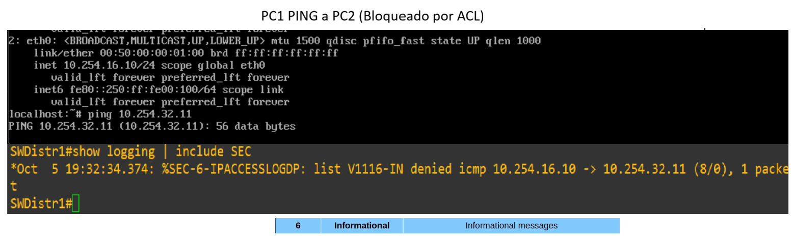

**Pruebas de comunicacion al servidor (HTTP/HTTPS)**

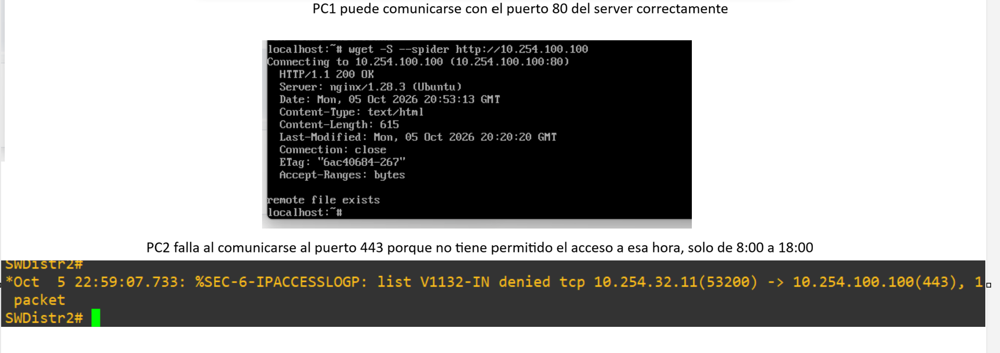


##  Skills Learned

• Configuración de DHCP Server en Ubuntu Server.

• Configuración de un servidor web Nginx básico en Ubuntu Server.

• Configuración y comprensión de ACLs.

• Configuración de NAT.

• Comprensión de logging/syslog y sus niveles de severidad:

	• 0 = Emergency
	• 1 = Alert
	• 2 = Critical
	• 3 = Error
	• 4 = Warning
	• 5 = Notification
	• 6 = Informational
	• 7 = Debugging
• Configuración de seguridad de puertos, DHCP Snooping, DAI y Port-Security.
